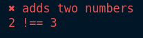
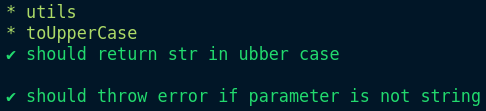

# basic jest like framework

for demo purpose

> to give the gist about how testing frameworks works

check `basic-jest/index.js` for the implementation details of the framework

## Usage

```js
const { test, expect } = require("./basic-jest");

function add(a, b) {
  return a * b;
}

test("adds two numbers", () => {
  const actual = add(1, 2);
  const expected = 3;

  expect(actual).toBe(expected);
});
```

output :



also check `src/__tests__` folder for more examples

## Run Examples

```sh
> node src/__tests__/math.test
```

output :


```sh
> node src/__tests__/utils.test
```

output:


